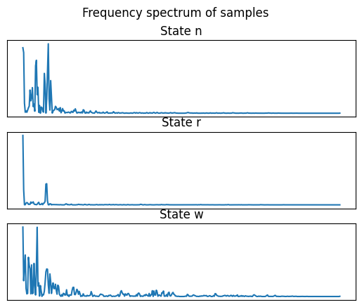
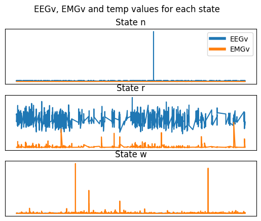

# Sleeping Mice

Antoine Blancy, Alexey Paulot

25.02.2023

---

# Introduction

 

* States of Mice:

  * Awake, REM Sleep, Non-REM Sleep
     

---

# Data available

**185 mice in groups of genetic clones**:

* For each mouse, we have a recording every $4s$ over 4 days:

  * Brainwave activity: amplitudes of varying frequencies,

  * EEGv, EMGv, Temperature,

  * State of the mouse

---

# Goal

## Using only the data provided, **predict the state of mice**.

---

# Approach

* At first:
  * Predict the state of a single mouse using its own data.
* Then:
  * Predict the state of a group of random mice using other mice's data.
* Finally
  * Predict the state of cloned mice using the data of a single "related" mouse.

---

# Presentation

#### 1. Data preprocessing and features

#### 2. Predicting the state of a single mouse

#### 3. Predicting the state of a group of mice

---

# 1. Data preprocessing and features

---

# Data preprocessing

* We have 4 days of data:
  * Only use the first 2 days, as they are undisturbed.
* 401 frequencies:
  * Min-max normalization
* EEGv, EMGv, & Temperature:
  * Min-max normalization

---

### Features:

#### Frequencies

* Brainwave activity is different in each state.
* Second half of the frequency spectrum is "useless"

---

### Features:

#### EEGv, EMGv, Temperature

Looks promising looking at the graphs.

But it varries wildly between different mice.

---

# Labels

**Multi-class classification** problem.

* 3 classes: Awake, REM Sleep, Non-REM Sleep

* One hot encoding, becomes:

  * [0,0,1] -> Awake
  * [0,1,0] -> Non-REM Sleep
  * [1,0,0] -> REM Sleep

* We can also infer the genetic group of a mouse if needed

---

## Class imbalance

Dataset is **highly imbalanced**:

* ~50% Awake
* ~40% Non-REM Sleep
* ~10% REM Sleep

* Dataset has a lot of data,
* Undersampling majority classes

---

## Test set

Mice have genetic groups:

* Test set has to represent as many groups as possible
* We picked out 1-3 mice from each group randomly to be in the test set

---

# 2. Predicting the state of a single mouse

---

# Model

For this part, we tried using many different models during the prototyping stage before balancing the dataset:

* Linear Regression (58% accuracy),
* Decision Trees (72% accuracy),
* Random Forests (72% accuracy),
* KNN (75% accuracy),
* SVMs (85% accuracy),
* Neural Networks (50% accuracy).

---

# Support Vector Machine

The best results were obtained using SVMs.

Very costly to train, both in time and memory.

Fewer config options than Neural Networks.

---

# Neural Network

Pros:

* Portable model,
* Easy to configure,
* Easy to train,
* Fast to train and predict.

---

# Neural Network Model (1)

Re-used the group prediction model after balancing the dataset.

* 203 neurons (1 for each input),

* 80 neurons in a hidden layer,
* 15 neurons in the next hidden layer,
* 10 neurons in the hidden layer after that,

* 3 neurons in the output layer.

---

# Neural Network Model (2)

* Activation functions: Softmax
* Optimizer: Adam, learning rate: $0.0015$
* Loss function: Categorical Crossentropy

---

# Results

* 88-95% accuracy on the test set with the following confusion matrix:

---

# 3. Predicting the state of a group of mice

---

# Model

The exact same model architecture as the single mouse prediction model was used.

---

# Genetic Clones (1)

Training on a single mouse from a group of clones.

Despite the results on single mice, the model was not able to predict the state of a group of mice:

* Accuracy: 35-45% -> No majority class though.

* Model is mostly guessing one of the 3 classes

---

# Genetic Clones (2)

* The best case scenario, which occurs rarely, looks like this:

* 1 class predicted most of the time.

---

# Random Mice

Not surprising: the model is not able to predict the state of a group of mice.

Same issues as the clone model.

---

# Random Mice (2)

* Single class being predicted.

* Although some other classes are predicted as well.

---

# Conclusion

* After normalizing, balancing, and filtering certain features: up to 95% accuracy on a single mouse!

* Despite training with huge datasets, the model is not able to predict the state of a group of mice.
  * Even for clones.

---

# Future work

* Try using more than 2 days of data.

* Try doing the opposite work
  * Predict Genetic group from brainwave activity during different states.

---

# Questions?
