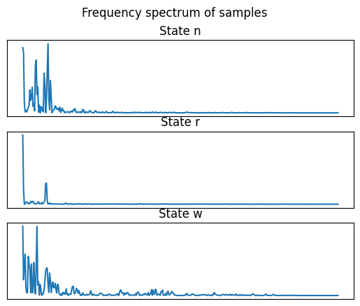
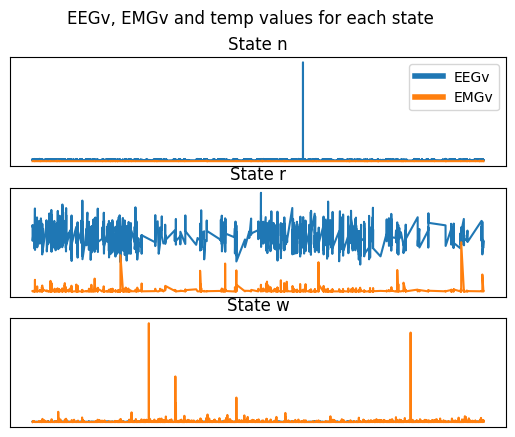

# Sleeping Mice

Antoine Blancy, Alexey Paulot

25.02.2023

---

# Introduction

 

- States of Mice:

  - Awake, REM Sleep, Non-REM Sleep
     

---

# Data available

**185 mice in groups of genetic clones**:

- For each mouse, we have a recording every $1/4s$ over 4 days:

  - Brainwave activity: amplitudes of varying frequencies,

  - EEGv, EMGv, Temperature,

  - State of the mouse

---

# Goal

## Using only the data provided, **predict the state of mice**.

---

# Approach

- At first:
  - Predict the state of a single mouse using its own data.
- Then:
  - Predict the state of a group of random mice using other mice's data.
- Finally
  - Predict the state of cloned mice using the data of a single "related" mouse.

---

# Presentation

#### 1. Data preprocessing and features

#### 2. Predicting the state of a single mouse

#### 3. Predicting the state of a group of mice

---

# 1. Data preprocessing and features

---

# Data preprocessing

- We have 4 days of data:
  - Only use the first 2 days, as they are undisturbed.
- 401 frequencies:
  - Min-max normalization
- EEGv, EMGv, Temperature:
  - Min-max normalization

---

### Features:

#### Frequencies

- Brainwave activity is different in each state.
- Second half of the frequency spectrum is "useless"

---

### Features:

#### EEGv, EMGv, Temperature

- Looks promising

---
